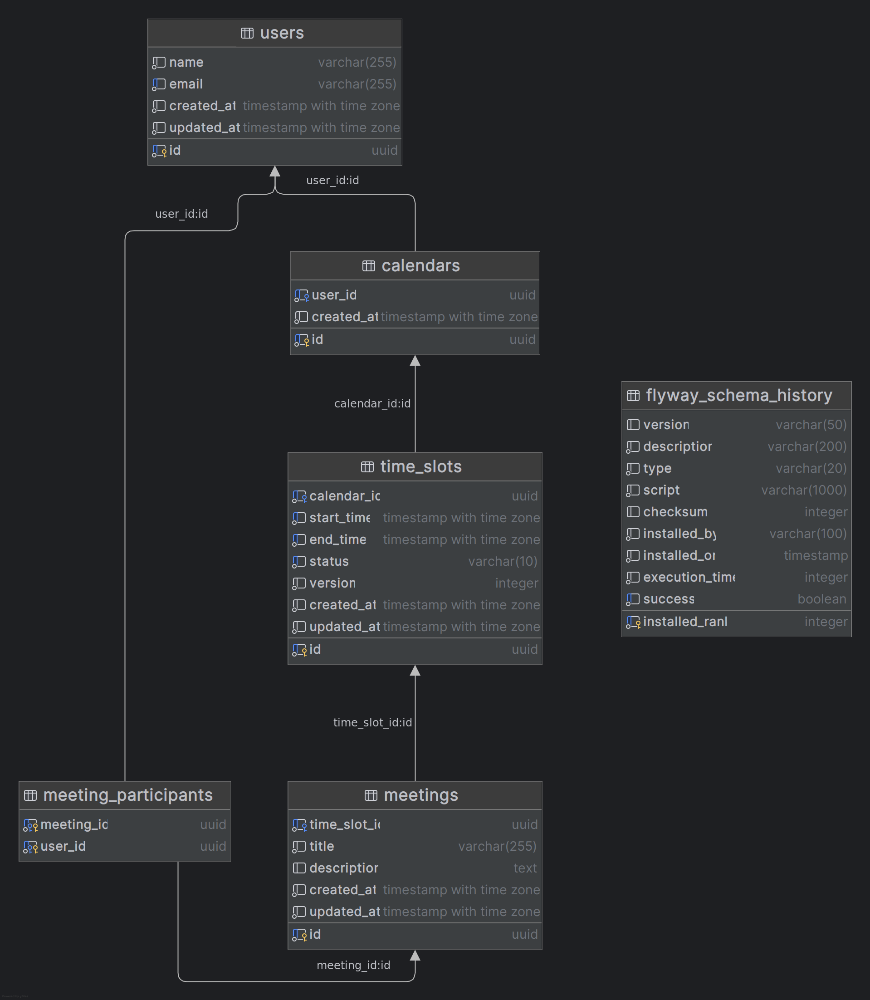

# meeting-schedule

## Overview
A meeting scheduling platform built with Spring Boot and Java. 
Users can manage time slots and schedule meetings.

## Architecture and Technologies
- **Spring Boot 4.0.2** for rapid development and production readiness.
- **Java 25**
- **PostgreSQL 18.1** as the database, managed via Docker Compose.
- **Flyway** for database migrations.
- **Domain Model:** User, Calendar, TimeSlot (with optimistic locking), Meeting, TimeSlotStatus.
- **Caching:** In-memory cache for common queries (future: Redis).
- **Observability:** Metrics, logs, and traces via Spring Boot OpenTelemetry.
- **Testing:** Unit and controller tests, load tests with Gatling.

## Database Schema
- **users** table: id (UUID), name, email, created_at, updated_at
- **calendars** table: id (UUID), user_id (UUID, unique), created_at
- **time_slots** table: id (UUID), calendar_id (UUID), start_time, end_time, status (FREE/BUSY), version, created_at, updated_at
- **meetings** table: id (UUID), time_slot_id (UUID), title, description, created_at, updated_at
- **meeting_participants** table: meeting_id (UUID), user_id (UUID)
- **flyway_schema_history** table: Used by Flyway to track database migrations.
- 

## Getting Started
### Prerequisites
- Java 25
- Maven 3.9+
- Docker and Docker Compose

## Running Locally with Docker Compose
1. Ensure Docker and Docker Compose are installed.
2. Run the following command in the project root to start the application, PostgreSQL, and Grafana/OTEL for observability:
```bash
./mvnw spring-boot:run
```
3. Service available at `http://localhost:8080` (API at `/api/1.0`)
4. PostgreSQL at `localhost:5432` (user: myuser, password: secret)
5. Grafana/OTEL at `localhost:3000` for observability dashboards (user: admin, password: admin).
- The LGTM stack is Grafana Labs' open-source observability stack. The acronym stands for:
  - Loki — for logs (log aggregation system)
  - Grafana — for visualization and dashboards
  - Tempo — for traces (distributed tracing backend)
  - Mimir — for metrics (long-term storage for Prometheus metrics)

### Running Tests
- Unit and controller tests, run the following command in the project root :
```bash
./mvnw test
```

### Running Load Tests
- Ensure the application is running locally, and then run the following command in the project root .
```bash
./mvnw gatling:test -Dgatling.simulationClass=com.bantunes82.meeting.schedule.loadtest.TimeSlotSimulation
```
- Results in `target/gatling/`

### API Endpoints and Usage
See [API.md](./API.md) for full documentation and curl examples.

### Time Slots
| Method | Path | Description | Status |
|--------|------|-------------|--------|
| POST | `/api/{version}/users/{userId}/time-slots` | Create time slot | 201 |
| GET | `/api/{version}/users/{userId}/time-slots/{slotId}` | Get single slot | 200 |
| PUT | `/api/{version}/users/{userId}/time-slots/{slotId}` | Update slot times | 200 |
| DELETE | `/api/{version}/users/{userId}/time-slots/{slotId}` | Delete slot | 204 |
| PATCH | `/api/{version}/users/{userId}/time-slots/{slotId}/status` | Change FREE/BUSY | 200 |

### Meetings
| Method | Path | Description | Status |
|--------|------|-------------|--------|
| POST | `/api/{version}/users/{userId}/time-slots/{slotId}/meetings` | Convert slot to meeting | 201 |
| GET | `/api/{version}/users/{userId}/meetings/{meetingId}` | Get meeting details | 200 |


### Observability Features
#### View traces in Grafana:
- Open http://localhost:3000
- Go to Explore (compass icon)
- Select Tempo as the data source
- Click Search and select service `meeting-schedule`
- Click on Run query to see the trace
- Click on a trace to see the span details
#### View metrics in Grafana:
- Open http://localhost:3000
- Go to Explore (compass icon)
- Select Prometheus as the data source
- Query for metrics like `meeting_get_controller_milliseconds_count` or `time_slot_create_controller_milliseconds_count`
- Click on Run query to see the metrics data
#### Viewing Logs in Grafana
- Open http://localhost:3000
- Go to Explore (compass icon)
- Select Loki as the data source
- Query for logs add the following label filters: {`service_name`=`meeting-schedule`}
- Click on Run query to see the logs
- Click on a log entry to see its trace context, then click the trace ID to jump directly to the trace in Tempo

## TODO / Future Improvements
- Replace in-memory cache with Redis for distributed caching and scalability.
- Implement integration tests for end-to-end scenarios.
- Expand load tests to evaluate performance under high concurrency.
- Add more test scenarios for time slot and meeting management.
- Enhance API documentation with more examples and edge cases.
- Consider additional observability features (alerts, custom dashboards).
